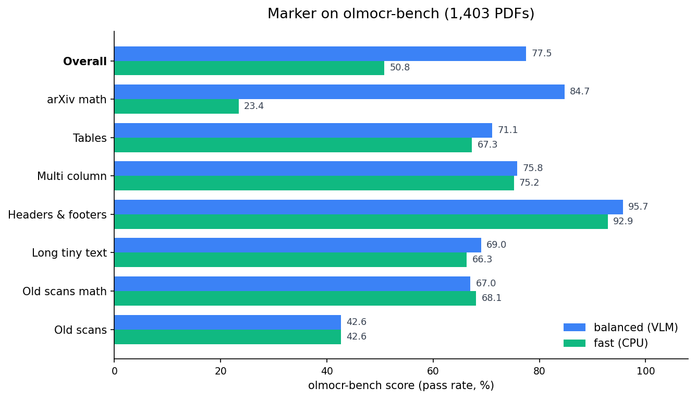

<p align="center">
  
</p>
<h1 align="center">Datalab</h1>
<p align="center">
  <strong>State of the Art models for Document Intelligence</strong>
</p>
<p align="center">
  <a href="https://www.gnu.org/licenses/gpl-3.0.html"></a>
  <a href="https://www.datalab.to/pricing"></a>
  <a href="https://discord.gg/KuZwXNGnfH"></a>
</p>
<p align="center">
  <a href="https://www.datalab.to"></a>
  <a href="https://documentation.datalab.to"></a>
  <a href="https://www.datalab.to/playground"></a>
</p>

<hr/>

# Marker

Marker converts documents to markdown, JSON, chunks, and HTML quickly and accurately.

- Converts PDF, image, PPTX, DOCX, XLSX, HTML, EPUB files in all languages
- Formats tables, forms, equations, inline math, links, references, and code blocks
- Extracts and saves images
- Removes headers/footers/other artifacts
- Extensible with your own formatting and logic
- Does structured extraction, given a JSON schema (beta)
- Optionally boost accuracy with LLMs (and your own prompt)
- Works on GPU, CPU, or MPS

## Try Datalab's Managed Platform

Our managed platform runs our latest open source model, [Chandra](https://github.com/datalab-to/chandra) — higher accuracy than Marker, with zero data retention by default, SOC 2 Type 2, and custom BAAs.

If you have high volume workloads, we offer a batch processing service that has processed 200M+ pages per week — we manage the infrastructure so your workloads finish on time.

Get started with **$5 in free credits** — [sign up](https://www.datalab.to/?utm_source=gh-marker) — takes under 30 seconds — or try our [public playground](https://www.datalab.to/playground?utm_source=gh-marker).

Commercial self-hosting requires a license — see [Commercial usage](#commercial-usage). For on-prem licensing, [contact us](https://www.datalab.to/contact?utm_source=gh-marker-onprem).

## Performance



We measure marker on [olmocr-bench](https://github.com/allenai/olmocr/tree/main/olmocr/bench), a third-party benchmark of 1,403 PDFs with ~7,000 unit tests covering math, tables, multi-column layout, scans, and hard edge cases.  Balanced mode scores **77.5%** overall — **81.6%** on digital PDFs — while fast mode handles clean digital documents on CPU alone at a fraction of the cost.

See [below](#benchmarks) for the full per-category scores and instructions on how to run your own benchmarks.

## Hybrid Mode

For the highest accuracy, pass the `--use_llm` flag to use an LLM alongside marker.  This will do things like merge tables across pages, handle inline math, format tables properly, and extract values from forms.  It works with Gemini, Claude, OpenAI-compatible, Azure, Vertex, or Ollama models.  By default, it uses `gemini-3.5-flash`.  See [below](#llm-services) for details.

## Examples

| PDF | File type | Markdown                                                                                                                     | JSON                                                                                                   |
|-----|-----------|------------------------------------------------------------------------------------------------------------------------------|--------------------------------------------------------------------------------------------------------|
| [Think Python](https://greenteapress.com/thinkpython/thinkpython.pdf) | Textbook | [View](https://github.com/VikParuchuri/marker/blob/master/data/examples/markdown/thinkpython/thinkpython.md)                 | [View](https://github.com/VikParuchuri/marker/blob/master/data/examples/json/thinkpython.json)         |
| [Switch Transformers](https://arxiv.org/pdf/2101.03961.pdf) | arXiv paper | [View](https://github.com/VikParuchuri/marker/blob/master/data/examples/markdown/switch_transformers/switch_trans.md) | [View](https://github.com/VikParuchuri/marker/blob/master/data/examples/json/switch_trans.json) |
| [Multi-column CNN](https://arxiv.org/pdf/1804.07821.pdf) | arXiv paper | [View](https://github.com/VikParuchuri/marker/blob/master/data/examples/markdown/multicolcnn/multicolcnn.md)                 | [View](https://github.com/VikParuchuri/marker/blob/master/data/examples/json/multicolcnn.json)         |

# Commercial usage

Our model weights use a modified AI Pubs Open Rail-M license (free for research, personal use, and startups under $2M funding/revenue) and our code is GPL. For broader commercial licensing or to remove GPL requirements, visit our pricing page [here](https://www.datalab.to/pricing?utm_source=gh-marker).

# Community

[Discord](https://discord.gg//KuZwXNGnfH) is where we discuss future development.

# Installation

You'll need python 3.10+ and [PyTorch](https://pytorch.org/get-started/locally/).

Install with:

```shell
pip install marker-pdf
```

If you want to use marker on documents other than PDFs, you will need to install additional dependencies with:

```shell
pip install marker-pdf[full]
```

# Usage

First, some configuration:

- **Mode** (`--mode balanced|fast`, default `balanced`):
  - `balanced` (best on a **GPU**) uses the surya VLM for layout, OCRs inline math, and re-OCRs the **whole page** whenever any of its embedded text is bad — highest quality.
  - `fast` (optimized for **CPU**) uses the lightweight rf-detr layout detector, extracts text with pdftext, and keeps VLM use minimal: equations, surgical block-level repair of individual garbled/empty blocks, and a single full-page pass only for pages that are scanned or mostly bad. A clean digital document without equations never starts the VLM server.
  - Tables are reconstructed from the PDF text layer in both modes (scanned tables come from the full-page OCR); low-confidence reconstructions fall back to the VLM, with a stricter bar in balanced.
  - `--disable_ocr` turns off **all** VLM calls (including equations) in either mode — pure text-layer extraction.
- Marker runs layout, OCR, and table recognition through a single surya VLM, served by a local inference server (used for OCR in both modes, and for layout in balanced mode).  The server is spawned automatically on first use - vLLM (docker) on NVIDIA GPUs, llama.cpp elsewhere.  You can also point marker at an already-running server with `SURYA_INFERENCE_URL=http://host:port/v1`.
- Useful server settings (all surya env vars): `SURYA_INFERENCE_BACKEND` (`vllm` or `llamacpp`), `SURYA_INFERENCE_PARALLEL` (concurrent requests — by default this auto-scales to the server's capacity: the GPU's `max_num_seqs` under vllm, a conservative slot count under llama.cpp; set an int only to override), `SURYA_INFERENCE_KEEP_ALIVE` (keep the server running between invocations), `VLLM_GPUS` (GPU indices for the server).
- Some PDFs, even digital ones, have bad text in them.  Set `--force_ocr` to force OCR on all pages, or the `strip_existing_ocr` to keep all digital text, and strip out any existing OCR text.
- Inline math is converted to LaTeX automatically in balanced mode (`ocr_inline_math`); in fast mode, set `--force_ocr` or `--ocr_inline_math` to get the same.

## Interactive App

I've included a streamlit app that lets you interactively try marker with some basic options.  Run it with:

```shell
pip install -U streamlit streamlit-ace
marker_gui
```

There is also a structured-extraction playground: `marker_extract`.

## Convert a single file

```shell
marker_single /path/to/file.pdf
```

You can pass in PDFs or images.

Options:
- `--mode [balanced|fast]`: Conversion mode (see above).  Defaults to `balanced`.
- `--disable_ocr`: Never call the VLM - pure text-layer extraction (equations and scanned pages are skipped).
- `--page_range TEXT`: Specify which pages to process. Accepts comma-separated page numbers and ranges. Example: `--page_range "0,5-10,20"` will process pages 0, 5 through 10, and page 20.
- `--output_format [markdown|json|html|chunks]`: Specify the format for the output results.
- `--output_dir PATH`: Directory where output files will be saved. Defaults to the value specified in settings.OUTPUT_DIR.
- `--paginate_output`: Paginates the output, using `\n\n{PAGE_NUMBER}` followed by `-` * 48, then `\n\n`
- `--use_llm`: Uses an LLM to improve accuracy.  You will need to configure the LLM backend - see [below](#llm-services).
- `--force_ocr`: Force OCR processing on the entire document, even for pages that might contain extractable text.
- `--block_correction_prompt`: if LLM mode is active, an optional prompt that will be used to correct the output of marker.  This is useful for custom formatting or logic that you want to apply to the output.
- `--strip_existing_ocr`: Remove all existing OCR text in the document and re-OCR with surya.
- `--redo_inline_math`: If you want the absolute highest quality inline math conversion, use this along with `--use_llm`.
- `--disable_image_extraction`: Don't extract images from the PDF.  If you also specify `--use_llm`, then images will be replaced with a description.
- `--debug`: Enable debug mode for additional logging and diagnostic information.
- `--processors TEXT`: Override the default processors by providing their full module paths, separated by commas. Example: `--processors "module1.processor1,module2.processor2"`
- `--config_json PATH`: Path to a JSON configuration file containing additional settings.
- `config --help`: List all available builders, processors, and converters, and their associated configuration.  These values can be used to build a JSON configuration file for additional tweaking of marker defaults.
- `--converter_cls`: One of `marker.converters.pdf.PdfConverter` (default) or `marker.converters.table.TableConverter`.  The `PdfConverter` will convert the whole PDF, the `TableConverter` will only extract and convert tables.
- `--llm_service`: Which llm service to use if `--use_llm` is passed.  This defaults to `marker.services.gemini.GoogleGeminiService`.
- `--help`: see all of the flags that can be passed into marker.  (it supports many more options then are listed above)

OCR runs through the surya VLM, which is multilingual - see the [surya README](https://github.com/datalab-to/surya) for details.  If you don't need OCR, marker can work with any language.

## Convert multiple files

```shell
marker /path/to/input/folder
```

- `marker` supports all the same options from `marker_single` above.
- `--workers` is the number of conversion workers to run simultaneously.  This is automatically set by default, but you can increase it to increase throughput, at the cost of more CPU usage.  All workers share a single inference server, which the parent process spawns.
- The parent budgets total VLM concurrency automatically: it reads the server's capacity and splits it across workers (aggregate in-flight ≈ 1.5× capacity), so adding workers never over-queues the server.  Set `SURYA_INFERENCE_PARALLEL` yourself only to override.
- With `--disable_ocr` no inference server is started at all, and the pool is sized purely by CPU cores.

### Batch sizing cheat sheet (e.g. 1000 docs)

- **One GPU machine**: `marker /folder --output_dir out` — defaults handle it: one vllm server, a CPU-sized worker pool, concurrency budgeted to the GPU.  Add `--mode fast` if you want cheaper/faster conversion for mostly-digital corpora.
- **Multi-GPU machine**: same single command, with the server spanning GPUs: `VLLM_GPUS=0,1,2,3 marker /folder ...`
- **Multiple machines**: shard the file list — run one `marker` per node with `--num_chunks <nodes> --chunk_idx <this node>`.  Each node spawns its own server.
- **CPU-only / no VLM**: `marker /folder --disable_ocr` (pure text-layer extraction; equations and scanned pages are skipped).

## Use from python

See the `PdfConverter` class at `marker/converters/pdf.py` function for additional arguments that can be passed.

```python
from marker.converters.pdf import PdfConverter
from marker.models import create_model_dict
from marker.output import text_from_rendered

converter = PdfConverter(
    artifact_dict=create_model_dict(),
)
rendered = converter("FILEPATH")
text, _, images = text_from_rendered(rendered)
```

`rendered` will be a pydantic basemodel with different properties depending on the output type requested.  With markdown output (default), you'll have the properties `markdown`, `metadata`, and `images`.  For json output, you'll have `children`, `block_type`, and `metadata`.

### Custom configuration

You can pass configuration using the `ConfigParser`.  To see all available options, do `marker_single --help`.

```python
from marker.converters.pdf import PdfConverter
from marker.models import create_model_dict
from marker.config.parser import ConfigParser

config = {
    "output_format": "json",
    "ADDITIONAL_KEY": "VALUE"
}
config_parser = ConfigParser(config)

converter = PdfConverter(
    config=config_parser.generate_config_dict(),
    artifact_dict=create_model_dict(),
    processor_list=config_parser.get_processors(),
    renderer=config_parser.get_renderer(),
    llm_service=config_parser.get_llm_service()
)
rendered = converter("FILEPATH")
```

### Extract blocks

Each document consists of one or more pages.  Pages contain blocks, which can themselves contain other blocks.  It's possible to programmatically manipulate these blocks.

Here's an example of extracting all forms from a document:

```python
from marker.converters.pdf import PdfConverter
from marker.models import create_model_dict
from marker.schema import BlockTypes

converter = PdfConverter(
    artifact_dict=create_model_dict(),
)
document = converter.build_document("FILEPATH")
forms = document.contained_blocks((BlockTypes.Form,))
```

Look at the processors for more examples of extracting and manipulating blocks.

## Other converters

You can also use other converters that define different conversion pipelines:

### Extract tables

The `TableConverter` will only convert and extract tables:

```python
from marker.converters.table import TableConverter
from marker.models import create_model_dict
from marker.output import text_from_rendered

converter = TableConverter(
    artifact_dict=create_model_dict(),
)
rendered = converter("FILEPATH")
text, _, images = text_from_rendered(rendered)
```

This takes all the same configuration as the PdfConverter.  You can specify the configuration `force_layout_block=Table` to avoid layout detection and instead assume every page is a table.  Tables are emitted as HTML (`<table>`) blocks; `output_format=json` gives you the table blocks with their page bounding boxes.

You can also run this via the CLI with
```shell
marker_single FILENAME --use_llm --force_layout_block Table --converter_cls marker.converters.table.TableConverter --output_format json
```

### OCR Only

If you only want to run OCR, you can also do that through the `OCRConverter`.  Set `--keep_chars` to keep individual characters and bounding boxes (digital PDFs only - pages that go through the VLM return block-level HTML without character boxes).

```python
from marker.converters.ocr import OCRConverter
from marker.models import create_model_dict

converter = OCRConverter(
    artifact_dict=create_model_dict(),
)
rendered = converter("FILEPATH")
```

This takes all the same configuration as the PdfConverter.

You can also run this via the CLI with
```shell
marker_single FILENAME --converter_cls marker.converters.ocr.OCRConverter
```

### Structured Extraction (beta)

You can run structured extraction via the `ExtractionConverter`.  This requires an llm service to be setup first (see [here](#llm-services) for details).  You'll get a JSON output with the extracted values.

```python
from marker.converters.extraction import ExtractionConverter
from marker.models import create_model_dict
from marker.config.parser import ConfigParser
from pydantic import BaseModel

class Links(BaseModel):
    links: list[str]

schema = Links.model_json_schema()
config_parser = ConfigParser({
    "page_schema": schema
})

converter = ExtractionConverter(
    artifact_dict=create_model_dict(),
    config=config_parser.generate_config_dict(),
    llm_service=config_parser.get_llm_service(),
)
rendered = converter("FILEPATH")
```

Rendered will have an `original_markdown` field.  If you pass this back in next time you run the converter, as the `existing_markdown` config key, you can skip re-parsing the document.

# Output Formats

## Markdown

Markdown output will include:

- image links (images will be saved in the same folder)
- formatted tables
- embedded LaTeX equations (fenced with `$$`)
- Code is fenced with triple backticks
- Superscripts for footnotes

## HTML

HTML output is similar to markdown output:

- Images are included via `img` tags
- equations are fenced with `<math>` tags
- code is in `pre` tags

## JSON

JSON output will be organized in a tree-like structure, with the leaf nodes being blocks.  Examples of leaf nodes are a single list item, a paragraph of text, or an image.

The output will be a list, with each list item representing a page.  Each page is considered a block in the internal marker schema.  There are different types of blocks to represent different elements.

Pages have the keys:

- `id` - unique id for the block.
- `block_type` - the type of block. The possible block types can be seen in `marker/schema/__init__.py`.  As of this writing, they are ["Line", "Span", "FigureGroup", "TableGroup", "ListGroup", "PictureGroup", "Page", "Caption", "Code", "Figure", "Footnote", "Form", "Equation", "Handwriting", "TextInlineMath", "ListItem", "PageFooter", "PageHeader", "Picture", "SectionHeader", "Table", "Text", "TableOfContents", "Document"]
- `html` - the HTML for the page.  Note that this will have recursive references to children.  The `content-ref` tags must be replaced with the child content if you want the full html.  You can see an example of this at `marker/output.py:json_to_html`.  That function will take in a single block from the json output, and turn it into HTML.
- `polygon` - the 4-corner polygon of the page, in (x1,y1), (x2,y2), (x3, y3), (x4, y4) format.  (x1,y1) is the top left, and coordinates go clockwise.
- `children` - the child blocks.

The child blocks have two additional keys:

- `section_hierarchy` - indicates the sections that the block is part of.  `1` indicates an h1 tag, `2` an h2, and so on.
- `images` - base64 encoded images.  The key will be the block id, and the data will be the encoded image.

Note that child blocks of pages can have their own children as well (a tree structure).

```json
{
      "id": "/page/10/Page/366",
      "block_type": "Page",
      "html": "<content-ref src='/page/10/SectionHeader/0'></content-ref><content-ref src='/page/10/SectionHeader/1'></content-ref><content-ref src='/page/10/Text/2'></content-ref><content-ref src='/page/10/Text/3'></content-ref><content-ref src='/page/10/Figure/4'></content-ref><content-ref src='/page/10/SectionHeader/5'></content-ref><content-ref src='/page/10/SectionHeader/6'></content-ref><content-ref src='/page/10/TextInlineMath/7'></content-ref><content-ref src='/page/10/TextInlineMath/8'></content-ref><content-ref src='/page/10/Table/9'></content-ref><content-ref src='/page/10/SectionHeader/10'></content-ref><content-ref src='/page/10/Text/11'></content-ref>",
      "polygon": [[0.0, 0.0], [612.0, 0.0], [612.0, 792.0], [0.0, 792.0]],
      "children": [
        {
          "id": "/page/10/SectionHeader/0",
          "block_type": "SectionHeader",
          "html": "<h1>Supplementary Material for <i>Subspace Adversarial Training</i> </h1>",
          "polygon": [
            [217.845703125, 80.630859375], [374.73046875, 80.630859375],
            [374.73046875, 107.0],
            [217.845703125, 107.0]
          ],
          "children": null,
          "section_hierarchy": {
            "1": "/page/10/SectionHeader/1"
          },
          "images": {}
        },
        ...
        ]
    }


```

## Chunks

Chunks format is similar to JSON, but flattens everything into a single list instead of a tree.  Only the top level blocks from each page show up. It also has the full HTML of each block inside, so you don't need to crawl the tree to reconstruct it.  This enable flexible and easy chunking for RAG.

## Metadata

All output formats will return a metadata dictionary, with the following fields:

```json
{
    "table_of_contents": [
      {
        "title": "Introduction",
        "heading_level": 1,
        "page_id": 0,
        "polygon": [...]
      }
    ], // computed PDF table of contents
    "page_stats": [
      {
        "page_id":  0,
        "text_extraction_method": "pdftext",
        "block_counts": [("Span", 200), ...]
      },
      ...
    ]
}
```

# LLM Services

When running with the `--use_llm` flag, you have a choice of services you can use:

- `Gemini` - this will use the Gemini developer API by default.  You'll need to pass `--gemini_api_key` to configuration.
- `Google Vertex` - this will use vertex, which can be more reliable.  You'll need to pass `--vertex_project_id`.  To use it, set `--llm_service=marker.services.vertex.GoogleVertexService`.
- `Ollama` - this will use local models.  You can configure `--ollama_base_url` and `--ollama_model`. To use it, set `--llm_service=marker.services.ollama.OllamaService`.
- `Claude` - this will use the anthropic API.  You can configure `--claude_api_key`, and `--claude_model_name`.  To use it, set `--llm_service=marker.services.claude.ClaudeService`.
- `OpenAI` - this supports any openai-like endpoint. You can configure `--openai_api_key`, `--openai_model`, and `--openai_base_url`. To use it, set `--llm_service=marker.services.openai.OpenAIService`.
- `Azure OpenAI` - this uses the Azure OpenAI service. You can configure `--azure_endpoint`, `--azure_api_key`, and `--deployment_name`. To use it, set `--llm_service=marker.services.azure_openai.AzureOpenAIService`.

These services may have additional optional configuration as well - you can see it by viewing the classes.

# Internals

Marker is easy to extend.  The core units of marker are:

- `Providers`, at `marker/providers`.  These provide information from a source file, like a PDF.
- `Builders`, at `marker/builders`.  These generate the initial document blocks and fill in text, using info from the providers.
- `Processors`, at `marker/processors`.  These process specific blocks, for example the table formatter is a processor.
- `Renderers`, at `marker/renderers`. These use the blocks to render output.
- `Schema`, at `marker/schema`.  The classes for all the block types.
- `Converters`, at `marker/converters`.  They run the whole end to end pipeline.

To customize processing behavior, override the `processors`.  To add new output formats, write a new `renderer`.  For additional input formats, write a new `provider.`

Processors and renderers can be directly passed into the base `PDFConverter`, so you can specify your own custom processing easily.

## API server

There is a very simple API server you can run like this:

```shell
pip install -U uvicorn fastapi python-multipart
marker_server --port 8001
```

This will start a fastapi server that you can access at `localhost:8001`.  You can go to `localhost:8001/docs` to see the endpoint options.

You can send requests like this:

```
import requests
import json

post_data = {
    'filepath': 'FILEPATH',
    # Add other params here
}

requests.post("http://localhost:8001/marker", data=json.dumps(post_data)).json()
```

Note that this is not a very robust API, and is only intended for small-scale use.  If you want to use this server, but want a more robust conversion option, you can use the hosted [Datalab API](https://www.datalab.to/plans).

# Troubleshooting

There are some settings that you may find useful if things aren't working the way you expect:

- If you have issues with accuracy, try setting `--use_llm` to use an LLM to improve quality.  You must set `GOOGLE_API_KEY` to a Gemini API key for this to work.
- Make sure to set `force_ocr` if you see garbled text - this will re-OCR the document.
- `TORCH_DEVICE` - set this to force the small local models (ocr error detection) onto a given torch device.  The VLM runs in the inference server - control its placement with `SURYA_INFERENCE_BACKEND` / `VLLM_GPUS`.
- If you're getting out of memory errors, decrease worker count.  You can also try splitting up long PDFs into multiple files.

## Debugging

Pass the `debug` option to activate debug mode.  This will save images of each page with detected layout and text, as well as output a json file with additional bounding box information.

# Benchmarks

## Overall PDF Conversion

We measure conversion quality with [olmocr-bench](https://github.com/allenai/olmocr/tree/main/olmocr/bench): 1,403 PDFs with ~7,000 pass/fail unit tests covering math rendering, table structure, reading order, headers/footers, and old scans.  Scores below are the fraction of unit tests passed, using the official olmocr-bench checker:

| Category | balanced | fast | disable_ocr |
|----------------------|----------|------|-------------|
| arXiv math           | 84.7     | 23.4 | 0.0         |
| Tables               | 71.1     | 67.3 | 48.1        |
| Multi column         | 75.8     | 75.2 | 68.9        |
| Headers & footers    | 95.7     | 92.9 | 95.3        |
| Long tiny text       | 69.0     | 66.3 | 68.3        |
| Old scans math       | 67.0     | 68.1 | 0.0         |
| Old scans            | 42.6     | 42.6 | 15.0        |
| **Overall**          | **77.5** | **50.8** | **32.3** |
| **Overall (digital PDFs only)** | **81.6** | **48.4** | **32.3** |

Notes:

- The digital-only split removes scanned PDFs and PDFs with a fake (previously OCR'd) text layer — 1,186 of the 1,403 PDFs.  Overall scores are test-weighted, and arXiv math makes up over half of the digital split's tests — that weighting is why fast mode's digital overall dips below its full-bench overall (and why `disable_ocr` barely moves) even though their non-math categories hold steady or improve on the digital split.
- `--disable_ocr` never calls the VLM.  Math scores zero because equations have no text-layer representation - the other rows show what the pure text-layer pipeline extracts on CPU.
- Fast mode's math score is low by design: it only block-OCRs equation blocks, not inline math inside text.  Use balanced mode for math-heavy documents.

## Throughput

With the shared inference server, throughput scales with server capacity rather than per-process VRAM: workers hold only small CPU models, and the parent budgets VLM concurrency across them automatically.  Clean digital pages in fast mode convert in well under a second per page on CPU alone.  Run `python benchmarks/throughput/main.py` to measure on your hardware ([sample long PDF](https://www.greenteapress.com/thinkpython/thinkpython.pdf)).

## Table Conversion

Marker can extract tables from PDFs using `marker.converters.table.TableConverter`.  Table quality is included in the olmocr-bench scores above (the `Tables` row).  Digital tables are reconstructed from the PDF text layer on CPU; scanned tables and low-confidence reconstructions fall back to the VLM.  The `--use_llm` flag can improve difficult tables further (multi-page merges, complex spans).

## Running your own benchmarks

To reproduce the olmocr-bench scores, convert the bench PDFs with marker (markdown output), then score the results with the [olmocr-bench harness](https://github.com/allenai/olmocr/tree/main/olmocr/bench) - it downloads the bench data and runs the unit tests against your outputs.

The repo also ships marker's own benchmark suite.  Install marker manually first:

```shell
git clone https://github.com/datalab-to/marker.git
poetry install
```

Download the benchmark data [here](https://drive.google.com/file/d/1ZSeWDo2g1y0BRLT7KnbmytV2bjWARWba/view?usp=sharing) and unzip, then run:

```shell
python benchmarks/overall/overall.py --methods marker --scores heuristic,llm
```

Options:

- `--use_llm` use an llm to improve the marker results.
- `--max_rows` how many rows to process for the benchmark.
- `--methods` can be `llamaparse`, `mathpix`, `docling`, `marker`.  Comma separated.
- `--scores` which scoring functions to use, can be `llm`, `heuristic`.  Comma separated.

There is also a table-focused benchmark against [FinTabNet](https://huggingface.co/datasets/datalab-to/fintabnet-test) (auto-downloaded):

```shell
python benchmarks/table/table.py --max_rows 100
```

Options:

- `--use_llm` uses an llm with marker to improve accuracy.
- `--use_gemini` also benchmarks gemini flash.

# How it works

Marker is a pipeline built around the [surya](https://github.com/datalab-to/surya) VLM, served by a local inference server, plus small CPU models:

- Extract embedded text with pdftext, in the PDF's reading order
- Detect page layout (a lightweight rf-detr detector in fast mode, the VLM in balanced mode)
- Decide per page whether the embedded text is usable; garbled or scanned pages are OCR'd by the VLM (full-page in balanced, surgically per-block in fast)
- Equations and inline math are recognized by the VLM (pdftext cannot represent math)
- Tables are reconstructed from the text layer with CPU heuristics; low-confidence reconstructions fall back to the VLM
- Optionally use an LLM to improve quality further
- Combine blocks and postprocess complete text

It only calls the VLM where necessary, which improves speed while keeping accuracy.

# Limitations

PDF is a tricky format, so marker will not always work perfectly.  Here are some known limitations that are on the roadmap to address:

- Very complex layouts, with nested tables and forms, may not work
- Forms may not be rendered well

Note: Passing the `--use_llm` and `--force_ocr` flags will mostly solve these issues.

# Usage and Deployment Examples

You can always run `marker` locally, but if you wanted to expose it as an API, we have a few options:
- Our platform API which is powered by `marker` and `surya` and is easy to test out - it's free to sign up, and we'll include credits, [try it out here](https://datalab.to)
- Our painless on-prem solution for commercial use, which you can [read about here](https://www.datalab.to/blog/self-serve-on-prem-licensing) and gives you privacy guarantees with high throughput inference optimizations.
- [Deployment example with Modal](./examples/README_MODAL.md) that shows you how to deploy and access `marker` through a web endpoint using [`Modal`](https://modal.com). Modal is an AI compute platform that enables developers to deploy and scale models on GPUs in minutes.
